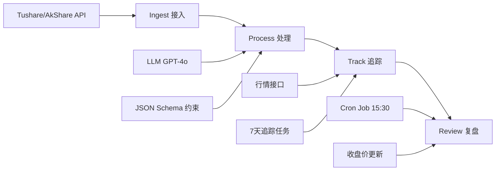

# NewsTrace Skills - 金融新闻智能审计与回溯系统

## 技能概述

NewsTrace 是一个集"语义审计"与"表现追踪"于一体的闭环式金融情报系统,将不可量化的新闻文字转化为可审计、可回测的科学资产。

**核心价值**: 构建"基于数据的信任(Data-Driven Trust)",通过技术手段剥离财经媒体的滤镜,让每一份情报的真实含金量在市场波动中无所遁形。

---

## 核心能力模块

### 1. AI语义审计引擎 (Semantic Audit Engine)

**功能**: 识别新闻在传播过程中的偏差、情绪化修饰和逻辑漏洞

**输入要素**:

- 原始快讯文本
- 市场译文/中文版本
- 新闻来源标识

**输出结构**:

```json
{
  "audit_result": {
    "score": 0-100,
    "risk_level": "High|Medium|Low",
    "warnings": ["具体风险点描述"],
    "semantic_deviations": [
      {
        "type": "情绪化修饰|逻辑阉割|建议变要求",
        "original": "原文表述",
        "translated": "译文表述",
        "impact": "对投资决策的影响"
      }
    ]
  },
  "recommended_tickers": [
    {
      "code": "股票代码",
      "name": "股票名称",
      "logic": "推荐逻辑",
      "beta": "高贝塔|低贝塔"
    }
  ],
  "logic_score": 0-100
}
```

**关键检测点**:

- ✅ 情绪化修饰识别 (如"暴涨"vs"increase")
- ✅ 逻辑断层检测
- ✅ 煽动性表达标注
- ✅ 翻译失真对比
- ✅ 建议与要求的语义区分

---

### 2. 时间胶囊机制 (Time Capsule Tracking)

**功能**: 通过三个关键时间节点,锁定新闻的"表现生命周期"

**时间线设计**:

| 节点 | 时间点 | 数据采集 | 作用 |
|------|--------|----------|------|
| **T0** | 新闻录入瞬间 | 实时股价快照 | 基准"入库价" |
| **T+N** | 发布后1-6天 | 每日收盘价 | 动态观察期 |
| **T+7** | 发布后第7天 | 最终收盘价 | 结案锁定,计算PnL |

**为什么选择T+7周期?**

- 避开A股"涨跌停"带来的短期波动干扰
- 让短线情绪沉淀,股价回归基本面价值
- 产出"信源含金量"而非单纯"涨幅数据"

**数据结构**:

```json
{
  "news_id": "唯一标识",
  "ticker": "600519.SH",
  "t0_price": 1850.00,
  "t0_timestamp": "2026-01-20 09:35:00",
  "tracking_prices": {
    "T+1": 1865.50,
    "T+2": 1842.30,
    "T+3": 1888.00,
    "T+4": 1901.20,
    "T+5": 1895.60,
    "T+6": 1910.00,
    "T+7": 1925.00
  },
  "final_pnl": "+4.05%",
  "status": "closed"
}
```

---

### 3. 技术链路自动化 (Automated Pipeline)

**数据处理全生命周期**:



**关键技术组件**:

1. **数据接入层**
   - API: Tushare / AkShare Python SDK
   - 监听: A股快讯实时流
   - 触发: Webhook / 定时轮询

2. **AI处理层**
   - 模型: GPT-4o / Claude
   - 约束: 严格JSON Schema
   - 输出: 结构化审计结果

3. **追踪调度层**
   - 任务: 每个新闻标的开启7天追踪
   - 定时: Cron Job (每日15:30)
   - 存储: 时序数据库

4. **复盘分析层**
   - 计算: PnL、波动率、夏普比率
   - 聚合: 信源维度统计
   - 输出: 红黑榜评级

---

### 4. 信源公信力评级系统 (Source Credibility Rating)

**功能**: 将定性的媒体分析转化为定量的风险评级

**评级维度**:

| 指标 | 计算方式 | 权重 |
|------|----------|------|
| **平均收益率** | Σ(T+7 PnL) / 新闻数量 | 40% |
| **辟谣率** | 被标记High Risk且市场打脸次数 / 总数 | 30% |
| **逻辑评分** | 平均logic_score | 20% |
| **推荐准确率** | 推荐标的涨幅>0的比例 | 10% |

**红黑榜输出**:

```json
{
  "source_ranking": [
    {
      "source_name": "财联社",
      "avg_return": "+3.2%",
      "rumor_rate": "12%",
      "avg_logic_score": 78,
      "accuracy": "68%",
      "grade": "A",
      "recommendation": "高可信度信源"
    },
    {
      "source_name": "某自媒体",
      "avg_return": "-1.8%",
      "rumor_rate": "45%",
      "avg_logic_score": 42,
      "accuracy": "35%",
      "grade": "D",
      "recommendation": "建议过滤"
    }
  ]
}
```

---

## 使用场景

### 场景1: 实时新闻审计

**输入**:

```
快讯: "重磅!消费税改革方案出台,白酒板块暴涨在即!"
```

**处理流程**:

1. AI语义审计识别"暴涨"为情绪化修饰
2. 提取标的: 贵州茅台(600519.SH)、五粮液(000858.SZ)
3. 记录T0价格并开启7天追踪
4. 输出风险等级: High (逻辑评分: 45)

### 场景2: 历史回溯分析

**查询**: "过去30天,哪些信源的推荐最准确?"

**输出**:

- 信源红黑榜
- 各信源平均收益率曲线
- 高风险新闻占比统计
- 推荐操作: 优先关注A级信源

### 场景3: 投资决策辅助

**场景**: 看到某财经号推荐某科技股

**系统提示**:

```
⚠️ 风险警告
- 该信源历史辟谣率: 38%
- 平均逻辑评分: 52/100
- 过去推荐平均收益: -2.1%
- 建议: 谨慎对待,等待更多验证
```

---

## 开发者集成指南

### 快速开始

```python
from newstrace import NewsTraceEngine

# 初始化引擎
engine = NewsTraceEngine(
    api_key="your_llm_api_key",
    data_source="tushare",
    db_config={...}
)

# 处理新闻
result = engine.process_news(
    title="消费税改革方案出台",
    content="...",
    source="财联社",
    timestamp="2026-01-20 09:35:00"
)

# 开启追踪
engine.start_tracking(
    news_id=result['news_id'],
    tickers=result['recommended_tickers'],
    duration_days=7
)

# 查询结果 (7天后)
pnl_report = engine.get_tracking_result(result['news_id'])
```

### JSON Schema 示例

```json
{
  "$schema": "http://json-schema.org/draft-07/schema#",
  "type": "object",
  "required": ["audit_result", "recommended_tickers"],
  "properties": {
    "audit_result": {
      "type": "object",
      "required": ["score", "risk_level", "warnings"],
      "properties": {
        "score": {"type": "integer", "minimum": 0, "maximum": 100},
        "risk_level": {"type": "string", "enum": ["High", "Medium", "Low"]},
        "warnings": {"type": "array", "items": {"type": "string"}}
      }
    },
    "recommended_tickers": {
      "type": "array",
      "maxItems": 3,
      "items": {
        "type": "object",
        "required": ["code", "name", "logic"],
        "properties": {
          "code": {"type": "string", "pattern": "^\\d{6}\\.(SH|SZ)$"},
          "name": {"type": "string"},
          "logic": {"type": "string"}
        }
      }
    }
  }
}
```

---

## 核心学习点

### 1. 科学回测思维

- ❌ 错误: "我觉得这新闻利好"
- ✅ 正确: 用T0到T+7的数据闭环进行验证

### 2. 语义逻辑严密性

- 理解"建议"与"要求"在金融语境下的估值差异
- 学会利用AI识别"信息污染"
- 识别翻译过程中的情绪放大

### 3. 工程自动化闭环

- 掌握LLM作为中间件的使用
- 通过JSON Schema实现AI输出的结构化
- 从数据抓取到定时结算的全流程自动化

---

## 技术栈要求

### 必需组件

- **Python**: 3.8+
- **LLM API**: GPT-4o / Claude 3.5
- **数据源**: Tushare / AkShare
- **数据库**: PostgreSQL / MongoDB (时序数据)
- **调度**: APScheduler / Celery

### 可选增强

- **可视化**: Streamlit / Gradio Dashboard
- **告警**: 企业微信 / 钉钉 Webhook
- **回测**: Backtrader / Zipline

---

## 最佳实践

### 1. Schema设计原则

```
Schema是AI与系统自动化的"契约"
将LLM的感性判断强制约束为计算机可执行的字段
```

### 2. 时间窗口选择

- A股: T+7 (避开涨跌停干扰)
- 港股: T+5 (流动性更好)
- 美股: T+3 (24小时交易,反应更快)

### 3. 风险控制

- 单条新闻最多推荐3只标的
- High Risk新闻自动降权展示
- 辟谣率>30%的信源自动加入黑名单

---

## 总结

NewsTrace代表了未来金融科技的方向——**让"金融直觉"让位于"科学证据"**。

通过这套自动化的回溯系统:

- ✅ 杂乱无章的财经新闻 → 可追踪的资产
- ✅ 真假难辨的信息 → 可量化的数据
- ✅ 感性的投资决策 → 理性的风险评估

对于每一位金融从业者和开发者来说,掌握这套逻辑,不仅是在构建一个工具,更是在数字化时代**重塑自己的金融观察力**。
