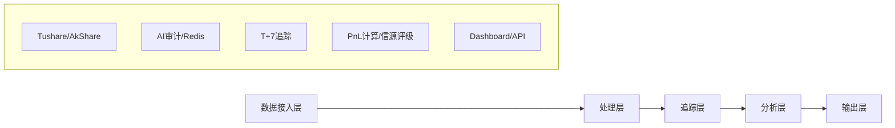

# NewsTrace - 金融新闻智能审计与回溯系统

[](https://opensource.org/licenses/MIT)
[](https://www.python.org/downloads/)
[](tests/)

> **📢 项目状态**: ✅ 已完成核心功能修复 (2026-01-26)  
> **🚀 快速启动**: 运行 `python main.py` 启动监控  
> **📚 完整文档**: 查看 [项目结构](#-项目结构) 和 [使用示例](#-使用示例)

## 🎯 项目简介

NewsTrace是一个集"语义审计"与"表现追踪"于一体的闭环式金融情报系统,将不可量化的新闻文字转化为可审计、可回测的科学资产。

**核心价值**: 构建"基于数据的信任(Data-Driven Trust)",通过技术手段剥离财经媒体的滤镜,让每一份情报的真实含金量在市场波动中无所遁形。

## ✨ 核心功能

- 🔍 **AI语义审计** - 识别新闻中的情绪化修饰、逻辑漏洞和翻译失真
- ⏱️ **时间胶囊追踪** - T+7自动化回测机制,验证新闻真实含金量
- 📊 **信源公信力评级** - 量化媒体可信度,生成红黑榜
- 🤖 **全流程自动化** - 从新闻接入到定时结算的闭环系统
- 📈 **可视化Dashboard** - 实时监控和数据分析
- 🔔 **智能告警** - 高风险新闻自动推送

## 🏗️ 系统架构



## 🚀 快速开始

### 1. 环境准备

```bash
# 克隆仓库
git clone <your-repo-url>
cd NewsTrace

# 复制环境变量配置
cp .env.example .env

# 编辑.env文件,填入你的API密钥
# OPENAI_API_KEY=sk-xxx
# TUSHARE_TOKEN=xxx
# DB_PASSWORD=xxx
```

### 2. Docker部署(推荐)

**前提**: 请确保已安装并启动 [Docker Desktop](https://www.docker.com/products/docker-desktop/)。

```bash
# 启动所有服务
docker-compose up -d

# 查看日志
docker-compose logs -f
```

**常见问题与故障排查**:

- **网页打不开**: 检查 Docker 是否处于 "Running" 状态,等待 1-2 分钟让服务完全启动。
- **镜像拉取失败**:
  - 方案 A: 在 Docker Desktop 设置中配置代理 (Settings -> Resources -> Proxies)。
  - 方案 B: 配置国内镜像源 (Settings -> Docker Engine, 添加 `registry-mirrors`)。
  - 方案 C: 使用离线镜像包导入。

### 3. 本地模式 (不依赖 Docker)

如果您的环境无法运行 Docker,可以使用本地模式:

```bash
# 安装依赖
pip install -r requirements.txt

# 运行初始化脚本 (仅首次)
python auto_setup.py

# 启动 Dashboard
streamlit run dashboard/app.py
```

*注意: 本地模式下数据将存储在本地 SQLite 文件中,功能会有所简化。*

## 📖 使用示例

### 命令行模式 (P1 级优化)

```bash
# 持续监控模式 (默认)
python main.py --mode=loop

# 单次运行模式 (适用于 GitHub Actions)
python main.py --mode=single_run

# 仅获取数据不分析 (测试用)
python main.py --dry-run
```

### Python SDK

```python
from src.newstrace_engine import NewsTraceEngine

# 初始化引擎
engine = NewsTraceEngine(config_path="config/config.yaml")

# 审计新闻
news = {
    "title": "消费税改革方案出台",
    "content": "...",
    "source": "财联社",
    "timestamp": "2026-01-25 09:35:00"
}

result = engine.audit_news(news)
print(f"评分: {result['audit_result']['score']}/100")
print(f"风险: {result['audit_result']['risk_level']}")

# 开启追踪
tracking_id = engine.start_tracking(
    news_id=result['news_id'],
    tickers=result['recommended_tickers']
)
```

### REST API

```bash
# 审计新闻
curl -X POST http://localhost:8000/audit \
  -H "Content-Type: application/json" \
  -d '{
    "title": "消费税改革方案出台",
    "content": "...",
    "source": "财联社"
  }'

# 获取信源排名
curl http://localhost:8000/sources/ranking?days=30
```

## 📁 项目结构

```text
NewsTrace/
├── src/                      # 核心代码
│   ├── newstrace_engine.py  # 主引擎
│   ├── news_fetcher.py      # 新闻采集器
│   ├── audit_engine.py      # AI审计引擎
│   ├── tracking_scheduler.py # 追踪调度器
│   ├── source_rating.py     # 信源评级
│   └── database.py          # 数据库管理
├── api/                      # FastAPI接口
├── dashboard/                # Streamlit Dashboard
├── config/                   # 配置文件
├── migrations/               # 数据库迁移
├── NewsTrace_Skills/         # 技能包文档
├── docker-compose.yml        # Docker配置
├── requirements.txt          # Python依赖
└── README.md                 # 本文件
```

## 🔧 配置说明

主配置文件: `config/config.yaml`

```yaml
newstrace:
  llm:
    provider: "openai"
    model: "gpt-4o"
  data_source:
    provider: "tushare"
  tracking:
    duration_days: 7
    update_time: "15:30"
```

## 📊 数据库设计

- **news** - 新闻表
- **audit_results** - 审计结果表
- **recommended_tickers** - 推荐标的表
- **tracking_tasks** - 追踪任务表
- **price_history** - 价格历史表(TimescaleDB)
- **source_ratings** - 信源评级表

## 🔄 工作流

1. **新闻采集** - 每小时从Tushare/AkShare获取最新财经新闻
2. **AI审计** - LLM分析新闻,输出评分和推荐标的
3. **开启追踪** - 记录T0价格,创建7天追踪任务
4. **每日更新** - 15:30自动更新收盘价
5. **T+7结案** - 计算PnL,更新信源评级

## 📈 监控指标

- 每日处理新闻数量
- 高风险新闻占比
- 追踪任务完成率
- 信源公信力评级

## 🤝 贡献指南

欢迎提交Issue和Pull Request!

## 📄 许可证

MIT License

## 🙏 致谢

- OpenAI GPT-4o
- Tushare / AkShare
- PostgreSQL / TimescaleDB

---

**让"金融直觉"让位于"科学证据"** 🚀
