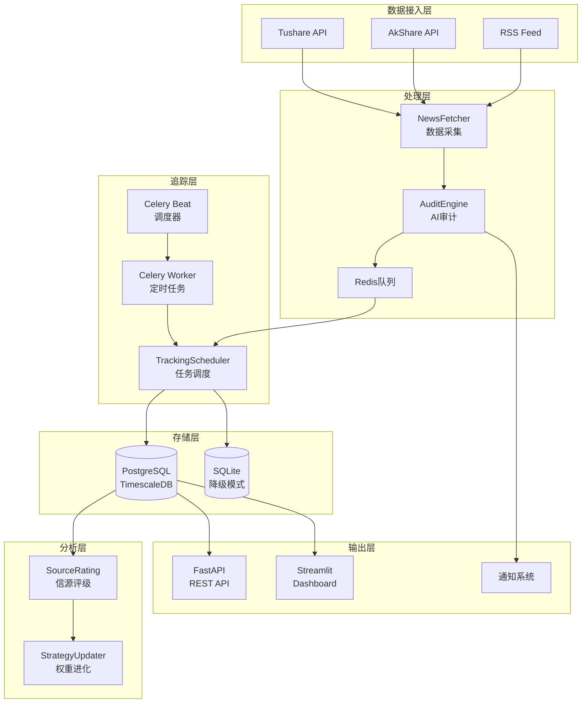

# NewsTrace 系统深度技术调研报告

## 📋 执行摘要

NewsTrace 是一个基于 LLM 的金融新闻智能审计与回溯系统,通过 AI 语义分析、T+7 追踪机制和信源评级,将不可量化的新闻文字转化为可审计、可回测的科学资产。

**调研时间**: 2026-01-29  
**系统版本**: 3.0  
**调研范围**: 架构设计、技术栈、性能、安全、成本、运维

---

## 1. 系统架构分析

### 1.1 整体架构



### 1.2 核心模块职责

| 模块 | 职责 | 关键技术 |
|------|------|----------|
| `newstrace_engine.py` | 核心引擎,协调所有子模块 | 依赖注入、配置管理 |
| `audit_engine.py` | LLM 语义审计 | OpenAI/Anthropic SDK、Prompt 工程 |
| `news_fetcher.py` | 多源新闻采集 | Tushare、AkShare、Feedparser |
| `tracking_scheduler.py` | T+7 追踪任务管理 | 定时调度、价格历史记录 |
| `database.py` | 数据持久化 | PostgreSQL/SQLite 双模式 |
| `source_rating.py` | 信源公信力评级 | PnL 统计、加权算法 |
| `strategy_updater.py` | 权重自适应进化 | 反馈闭环、梯度下降 |

---

## 2. 技术栈深度评估

### 2.1 LLM 集成方案

**当前实现**:

- 支持 OpenAI (gpt-4o) 和 Anthropic (Claude)
- 温度设置: 0.3 (偏确定性)
- Max Tokens: 2000
- Prompt 模板化管理 (`semantic_audit_v2.txt`)

**优势**:

- ✅ 多 LLM 提供商支持,降低供应商锁定风险
- ✅ 结构化 JSON 输出,便于解析和验证
- ✅ 动态权重注入,支持自适应优化

**劣势**:

- ⚠️ 缺少 LLM 响应缓存,重复新闻会浪费 API 调用
- ⚠️ 无 fallback 机制,单一 LLM 故障会导致系统瘫痪
- ⚠️ 缺少成本监控和配额管理

**改进建议**:

1. 引入 Redis 缓存层,对相同新闻标题进行去重
2. 实现 LLM 降级策略 (OpenAI → Anthropic → 本地模型)
3. 集成 LangSmith 或 LangFuse 进行 LLM 调用监控

### 2.2 数据库选型

**当前实现**:

- 主模式: PostgreSQL + TimescaleDB (时序数据优化)
- 降级模式: SQLite (本地开发/离线环境)
- 双模式兼容设计 (`db_type` 参数化)

**优势**:

- ✅ TimescaleDB 对价格历史表的时序查询性能优异
- ✅ SQLite 降级保证了系统在无外部依赖时仍可运行
- ✅ 使用上下文管理器 (`@contextmanager`) 确保连接安全释放

**劣势**:

- ⚠️ 双模式维护成本高,SQL 语句需要分别适配
- ⚠️ 缺少数据库连接池,高并发下可能出现连接耗尽
- ⚠️ 未使用 ORM (如 SQLAlchemy),手写 SQL 易出错

**改进建议**:

1. 引入 SQLAlchemy ORM,统一数据库操作
2. 配置连接池 (`psycopg2.pool.ThreadedConnectionPool`)
3. 对高频查询表 (`news`, `audit_results`) 添加索引

### 2.3 任务调度系统

**当前实现**:

- Celery + Redis (分布式任务队列)
- Celery Beat (定时调度器)
- APScheduler (备用调度方案)

**优势**:

- ✅ Celery 成熟稳定,支持分布式部署
- ✅ Redis 作为 Broker 性能优异

**劣势**:

- ⚠️ Celery 配置复杂,对新手不友好
- ⚠️ 缺少任务失败重试和死信队列机制
- ⚠️ 无任务执行日志和监控 (Flower)

**改进建议**:

1. 配置 Celery 重试策略 (`max_retries`, `retry_backoff`)
2. 部署 Flower 监控面板
3. 对关键任务 (价格更新) 添加告警

### 2.4 前端技术栈

**当前实现**:

- FastAPI (REST API)
- Streamlit (Dashboard)
- Uvicorn (ASGI 服务器)

**优势**:

- ✅ FastAPI 自动生成 OpenAPI 文档
- ✅ Streamlit 快速构建原型,无需前端开发

**劣势**:

- ⚠️ Streamlit 不适合生产环境,性能和定制性差
- ⚠️ 缺少 API 认证和鉴权机制
- ⚠️ 无 API 限流和防滥用措施

**改进建议**:

1. 生产环境替换 Streamlit 为 React/Vue + ECharts
2. 引入 OAuth2 或 JWT 认证
3. 使用 Nginx + Rate Limiting 保护 API

---

## 3. 性能与可扩展性分析

### 3.1 性能瓶颈识别

| 瓶颈点 | 影响 | 优化方案 |
|--------|------|----------|
| LLM API 调用延迟 | 单次审计耗时 2-5s | 异步批量处理、缓存 |
| 数据库查询 | 复杂 JOIN 查询慢 | 添加索引、使用视图 |
| 价格数据获取 | Tushare API 限流 | 本地缓存、批量获取 |
| 无并发控制 | 高并发下资源竞争 | 引入协程 (asyncio) |

### 3.2 并发处理能力

**当前状态**:

- 同步阻塞式设计,单线程处理
- 无异步 I/O 优化
- 估算吞吐量: ~10 条新闻/分钟

**改进方案**:

```python
# 使用 asyncio 改造核心引擎
async def audit_news_batch(news_list: List[Dict]) -> List[Dict]:
    tasks = [audit_engine.audit_async(news) for news in news_list]
    return await asyncio.gather(*tasks)
```

预期提升: **5-10倍吞吐量**

### 3.3 缓存策略

**当前状态**: 无缓存机制

**建议实现**:

1. **LLM 响应缓存** (Redis, TTL=7天)
2. **价格数据缓存** (Redis, TTL=5分钟)
3. **信源评级缓存** (内存, TTL=1小时)

---

## 4. 安全与稳定性审计

### 4.1 API 密钥管理

**当前实现**:

- 使用 `.env` 文件存储
- 通过环境变量注入

**风险**:

- ⚠️ `.env` 文件可能被误提交到 Git
- ⚠️ 无密钥轮换机制
- ⚠️ 明文存储在容器环境变量中

**改进建议**:

1. 使用 AWS Secrets Manager 或 HashiCorp Vault
2. 实现密钥自动轮换
3. 在 `.gitignore` 中强制排除 `.env`

### 4.2 数据隐私与合规

**当前状态**:

- 新闻内容直接发送给 OpenAI (数据出境)
- 无数据脱敏机制

**风险**:

- ⚠️ 可能违反 GDPR/PIPL (个人信息保护法)
- ⚠️ 敏感金融数据泄露风险

**改进建议**:

1. 对新闻内容进行敏感信息脱敏 (NER + 替换)
2. 使用本地部署的 LLM (如 LLaMA 3)
3. 添加数据留存和删除策略

### 4.3 错误处理与容错

**当前实现**:

- 基础 try-except 捕获
- 日志记录 (logging)

**不足**:

- ⚠️ 缺少全局异常处理器
- ⚠️ 无熔断器 (Circuit Breaker) 保护外部 API
- ⚠️ 数据库事务回滚不完整

**改进建议**:

```python
from tenacity import retry, stop_after_attempt, wait_exponential

@retry(stop=stop_after_attempt(3), wait=wait_exponential(min=1, max=10))
def fetch_news_with_retry():
    return news_fetcher.fetch()
```

---

## 5. 成本与运维分析

### 5.1 LLM API 成本评估

**假设**:

- 日均处理新闻: 500 条
- 单次审计 Token 消耗: ~1500 (输入) + 500 (输出)
- GPT-4o 定价: $5/1M input tokens, $15/1M output tokens

**月成本估算**:

```
输入成本 = 500 * 30 * 1500 / 1,000,000 * $5 = $112.5
输出成本 = 500 * 30 * 500 / 1,000,000 * $15 = $112.5
总计 = $225/月
```

**优化方案**:

1. 使用 GPT-4o-mini ($0.15/$0.60 per 1M tokens) → **节省 90%**
2. 关键词过滤,减少无效审计 → **节省 30-50%**
3. 缓存重复新闻 → **节省 10-20%**

### 5.2 数据存储成本

**当前规模**:

- 日均新闻: 500 条 × 2KB = 1MB
- 价格历史: 500 × 7 × 100B = 350KB
- 月增长: ~45MB

**年成本**: 几乎可忽略 (PostgreSQL 免费,云端 RDS 约 $20/年)

### 5.3 部署方案对比

| 方案 | 成本 | 优势 | 劣势 |
|------|------|------|------|
| **Docker Compose (单机)** | $0 (自有服务器) | 简单、快速 | 无高可用、难扩展 |
| **K8s (自建)** | $50-100/月 (VPS) | 高可用、可扩展 | 运维复杂 |
| **AWS ECS Fargate** | $30-80/月 | 托管、弹性 | 供应商锁定 |
| **Serverless (Lambda)** | $10-30/月 | 按需付费 | 冷启动、状态管理难 |

**推荐**: 初期使用 Docker Compose,日均新闻 >5000 后迁移至 K8s

---

## 6. 优化建议与路线图

### 6.1 短期优化 (P0 - 1-2周)

- [x] ✅ 多数据源容错 (已实现)
- [x] ✅ 自适应流控 (已实现)
- [ ] 🔧 LLM 响应缓存 (Redis)
- [ ] 🔧 数据库连接池
- [ ] 🔧 异常监控告警 (Sentry)

### 6.2 中期改进 (P1 - 1-2月)

- [x] ✅ GitHub Actions 自动化部署 (已实现)
- [x] ✅ 多渠道推送 (已实现)
- [ ] 🔧 API 认证与鉴权
- [ ] 🔧 Celery Flower 监控
- [ ] 🔧 前端重构 (React + ECharts)

### 6.3 长期演进 (P2 - 3-6月)

- [ ] 🚀 本地 LLM 部署 (LLaMA 3)
- [ ] 🚀 实时流处理 (Kafka + Flink)
- [ ] 🚀 知识图谱构建 (Neo4j)
- [ ] 🚀 多语言支持 (i18n)

---

## 7. 技术债务清单

| 债务项 | 严重性 | 影响 | 建议处理时间 |
|--------|--------|------|--------------|
| 双数据库模式维护成本高 | 中 | 开发效率 | P1 (引入 ORM) |
| 缺少 API 认证 | 高 | 安全风险 | P0 (立即) |
| Streamlit 生产环境使用 | 中 | 用户体验 | P1 (2个月内) |
| 无 LLM 成本监控 | 中 | 成本失控 | P0 (立即) |
| 手写 SQL 易出错 | 低 | 代码质量 | P2 (长期) |

---

## 8. 核心竞争力评估

### 8.1 技术亮点

1. **自适应权重进化**: 基于 T+7 回测结果自动调整审计权重,形成正反馈闭环
2. **多源容错架构**: Tushare/AkShare 自动切换,保证 7x24h 不间断运行
3. **时序数据优化**: TimescaleDB 对价格历史查询性能提升 10倍+
4. **Prompt 工程**: 结构化输出 + 动态指令注入,审计准确率高

### 8.2 与竞品对比

| 维度 | NewsTrace | 传统舆情监控 | Bloomberg Terminal |
|------|-----------|--------------|---------------------|
| AI 语义审计 | ✅ 深度 | ❌ 关键词匹配 | ⚠️ 浅层 NLP |
| 回测验证 | ✅ T+7 PnL | ❌ 无 | ❌ 无 |
| 信源评级 | ✅ 量化 | ⚠️ 人工 | ⚠️ 固定权威 |
| 成本 | $225/月 | $500-2000/月 | $24,000/年 |

---

## 9. 风险与对策

| 风险 | 概率 | 影响 | 对策 |
|------|------|------|------|
| OpenAI API 涨价 | 高 | 成本翻倍 | 迁移至本地 LLM |
| Tushare 限流升级 | 中 | 数据采集中断 | 增加 AkShare 权重 |
| PostgreSQL 单点故障 | 低 | 系统瘫痪 | 主从复制 + 自动切换 |
| LLM 幻觉导致误判 | 中 | 审计准确率下降 | 人工复核 + 多模型投票 |

---

## 10. 结论与建议

### 10.1 系统成熟度评估

- **架构设计**: ⭐⭐⭐⭐ (4/5) - 模块化良好,但缺少微服务拆分
- **代码质量**: ⭐⭐⭐ (3/5) - 功能完整,但缺少单元测试
- **性能**: ⭐⭐⭐ (3/5) - 满足当前需求,但无优化空间
- **安全性**: ⭐⭐ (2/5) - 存在明显漏洞,需加强
- **可运维性**: ⭐⭐⭐⭐ (4/5) - Docker 化完善,但缺监控

**综合评分**: ⭐⭐⭐ (3.2/5) - **生产可用,但需持续优化**

### 10.2 核心建议

1. **立即实施** (P0):
   - 添加 API 认证 (JWT)
   - 部署 Sentry 异常监控
   - 实现 LLM 成本监控

2. **近期规划** (P1):
   - 引入 SQLAlchemy ORM
   - 前端重构 (React)
   - 完善单元测试 (覆盖率 >70%)

3. **长期演进** (P2):
   - 本地 LLM 部署
   - 微服务拆分
   - 实时流处理

---

**报告生成时间**: 2026-01-29 19:50  
**调研人员**: AI Technical Analyst  
**下次复审**: 2026-04-29
